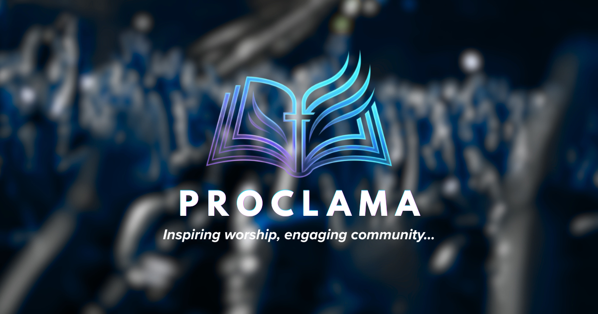

# Proclama 

**Proclama** es un presentador multimedia multiplataforma moderno, rápido y elegante diseñado específicamente para iglesias y congregaciones. Permite proyectar canciones (hinario), versículos bíblicos (Sagrada Escritura) y archivos multimedia (imágenes/videos) a pantallas secundarias o proyectores, ofreciendo además control remoto inalámbrico desde teléfonos móviles y un tema visual oscuro de alto contraste (*Flat Card UI*) pensado para evitar la fatiga visual del operador.

---

> [!IMPORTANTE]
> **Licenciamiento y Período de Prueba:** Proclama ofrece una licencia perpetua de **$49 USD (pago único)** para desbloquear todas las capacidades de nivel profesional. Para iglesias pequeñas, cuenta con una versión gratuita (**Free Evaluation Edition**) totalmente operativa y de uso indefinido que aplica restricciones básicas (marca de agua discreta en proyección, límite de 3 versiones de la Biblia, límite diario de 10 cambios de diapositiva en el control remoto web, y desactivación de módulos de red y avanzados como NDI, Stage Display, Modo Chroma o Respaldos automatizados). Para cotizaciones y adquisición de licencias, por favor póngase en contacto a través de: `dkantun [at] gmail [dot] com`.

---

## Características Principales

*   **Doble Pantalla Dinámica:** Panel de control de operador independiente y ventana de proyección activa (`Proclama Media Player`) a pantalla completa con controles de atenuación automática y reproducción multimedia silenciosa en vista previa. Sincronización bidireccional en tiempo real de volumen y posición de video.
*   **Auto-ocultado de Cursor:** En la ventana de proyección a pantalla completa, el cursor del mouse desaparece tras 3 segundos de inactividad y reaparece automáticamente con el movimiento.
*   **Reescalado de Imagen de Calidad:** Soporta interpolación bilineal suave (`SmoothPixmapTransform`) y adaptabilidad a altas densidades de píxeles (High-DPI) para evitar la pixelación de diapositivas y videos.
*   **Importación Nativa de PDFs:** Importador multiplataforma de PDFs integrado mediante la API de C++ `Qt6::Pdf`. Divide documentos de presentación de forma instantánea en páginas y las introduce directamente como diapositivas en la playlist.
*   **Buscador Inteligente al Vuelo (Spotlight):** Atajo global rápido (**`Ctrl + F`**) para buscar y proyectar escrituras instantáneamente por referencia exacta (ej. *Juan 3:16*) o coincidencia de frase (ej. *amó Dios al mundo*).
*   **Galería de Fondos Predefinidos:** Selección integrada de 6 espectaculares fondos de pantalla libres de derechos (aves, flores, mar, bosque, selva, desierto) sin uso de IA.
*   **Editor de Plantillas Visuales:** Panel integrado de configuración visual para modificar la fuente, activar negrita, definir el alto relativo de letra en pantalla (del 4.0% al 15.0%), elegir colores mediante paleta interactiva (`QColorDialog`) y ajustar la alineación vertical (Superior, Centrado, Inferior) del texto proyectado.
*   **Fondo Predeterminado Global:** Opción integrada en la plantilla visual para definir una imagen o video de fondo predeterminado para las diapositivas de canciones y versículos bíblicos de forma centralizada.
*   **Transiciones Suaves (Crossfade):** Efecto cinematográfico de desvanecimiento suave y progresivo (Crossfade) al cambiar de diapositiva o limpiar el texto, configurable en duración (100 ms a 2000 ms) a través del panel de Opciones.
*   **Copia de Seguridad y Respaldo Integrado:** Generador y restaurador nativo de copias de seguridad (`.proclamabackup`) que empaqueta y restaura toda la base de datos de la iglesia (canciones, biblias) y los ajustes de configuración (Requiere licencia PRO).
*   **Control Remoto Web:** Servidor HTTP integrado para controlar la playlist, reproducir videos y activar atajos rápidos de proyector (Limpiar texto, Pantalla negra, Logotipo) desde cualquier smartphone o tablet. En la versión gratuita, está **limitado a 10 cambios de diapositiva diarios** que se restablecen automáticamente cada día.
*   **Atenuación Selectiva (Dim Layer):** Capa inteligente de sombra al 43% que mejora el contraste y legibilidad del texto sobre fondos multimedia brillantes.
*   **Prevención de Suspensión Multiplataforma:** Evita el apagado automático del monitor y el estado de suspensión del sistema de forma nativa mientras la aplicación está en ejecución en Windows (Win32), macOS (IOKit) y Linux (D-Bus).
*   **Diseño Moderno con Sidebar:** Tema oscuro premium (*Flat Card UI*) con una barra de navegación lateral izquierda que apila las bibliotecas de canciones, biblias y multimedia, accesos rápidos y Splitters redimensionables.
*   **Barra de Título Personalizada (Frameless Window):** Ventana sin bordes del sistema operativo con una barra superior personalizada que contiene los botones de control (Minimizar, Maximizar, Cerrar) integrados al diseño de la aplicación, soportando arrastre y maximización por doble clic.
*   **Importación desde Software Competidor (Migración):** Importador en un solo clic integrado en Opciones para leer bases de datos e historiales de Holyrics (JSON/TXT) y OpenLP (SQLite/XML) de forma directa y 100% nativa.
*   **Planificador de Servicios (Liturgia):** Permite organizar el culto de forma visual insertando separadores de secciones (ej: *CENA DEL SEÑOR*, *PREDICACIÓN*) en la playlist, con formato destacado en negrita y color de realce dinámico.
*   **Tablero de Gráficos Estadísticos:** Muestra en el Historial gráficos de barras horizontales (escalados según el máximo e integrados con la paleta de colores activa) con filtros avanzados por período de tiempo (30 días, 6 meses, 1 año) y tipo.
